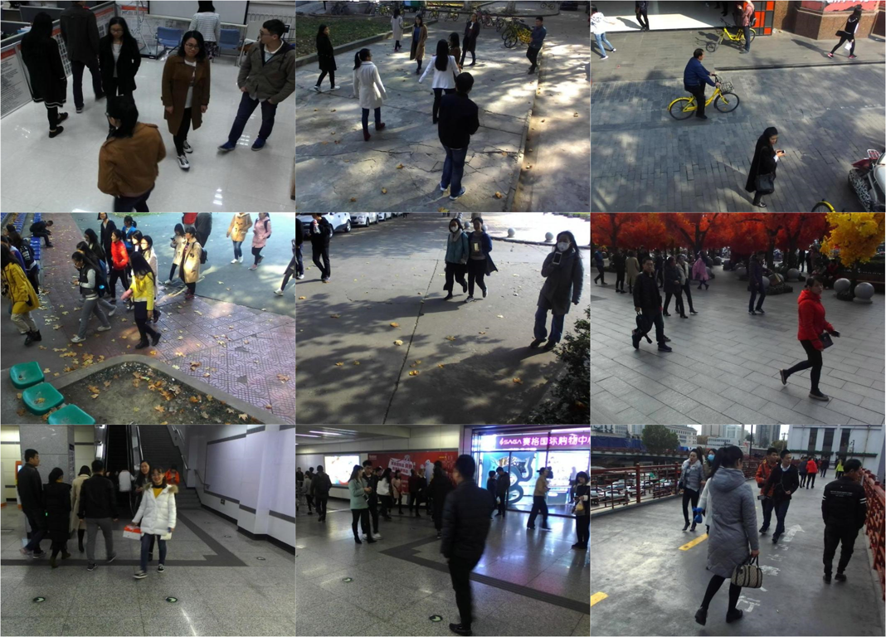

### Abstract

Tracking multiple people in crowds is a fundamental and essential task in the field of intelligent video surveillance, and it is often
hindered by difficulties such as dynamic occlusion between objects, cluttered background and abrupt illumination changes. In this 
paper, we propose a novel robust stereo vision tracking method based on two-tier data association to improve the effect of 
multi-object tracking in a crowded environment. More specifically, first we present a novel multi-level object segmentation method 
based on the object visualization, which combines the results of deep learning detection method with the 3-dimensional information
obtained by stereo vision algorithm to get precise segmentation results in the image. Thereafter, we propose a novel two-tier data
association method based on the precise segmentation results, which aiming at producing complete tracks of multiple objects in the 
case of severe occlusion. Finally, we construct a real-time stereo vision tracking system for multi-object tracking and build a 
diverse stereo dataset, including a variety of real challenging indoor and outdoor scenes. The comprehensive experiments verify the
effective and robust tracking performance of our approach in various crowded scenes. In addition, the qualitative and quantitative
comparison resultsunderline the superiority of the proposed algorithm over the tested state-of-the-art tracking approaches.

### Data

Dataset and demo video can be downloaded [here](https://pan.baidu.com/s/1mhNoivQ),Total in size = 2.37G. Data was caputred 30frames/s, 
and the resolution of each frame is 1011*512. Each frame has been calibrated, can be directly done binocular stereo matching.

### Performance

Demo video for Joint Visibility Segmentation and Two-tier Data Association for Multiple People Tracking in Crowds can be download [here](https://youtu.be/nrwuVlZTUeE).
