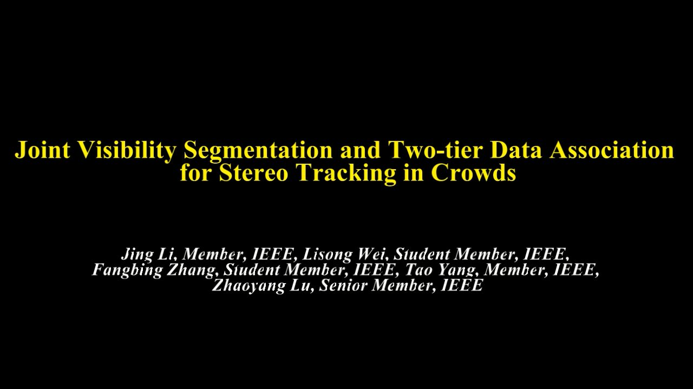

### Abstract

Tracking multiple people in crowds is a fundamental and essential task in the field of intelligent video surveillance, and it is often
hindered by difficulties such as dynamic occlusion between objects, cluttered background and abrupt illumination changes. In this 
paper, we propose a novel joint visibility segmentation strategy and a two-tier data association method for stereo tracking in crowds. 
More specifically, first we present a novel visibility segmentation method, which combines the results of deep learning detection method
with the 3-dimensional information obtained by stereo vision algorithm to get precise segmentation results in the image. Thereafter, 
we propose a novel two-tier data association method based on the precise segmentation results, which aiming at improving the performance
of multiple object tracking in severe occlusion. Finally, we construct a real-time stereo tracking system and build a diverse stereo
dataset, including a variety of real challenging indoor and outdoor scenes. The comprehensive experiments verify the effective and 
robust tracking performance of our approach in various crowded scenes. In addition, the qualitative and quantitative comparison results
underline the superiority of the proposed algorithm over the tested state-of-the-art tracking approaches

### Data

Dataset and demo video can be downloaded [here](https://pan.baidu.com/s/1qXJcy76),Total in size = 2.37G. Data was caputred 30frames/s, 
and the resolution of each frame is 1011*512. Each frame has been calibrated, can be directly done binocular stereo matching.

### Performance

Demo video for Joint Visibility Segmentation and Two-tier Data Association for Stereo Tracking in Crowds can be download [here](https://pan.baidu.com/s/1htOFKig).
